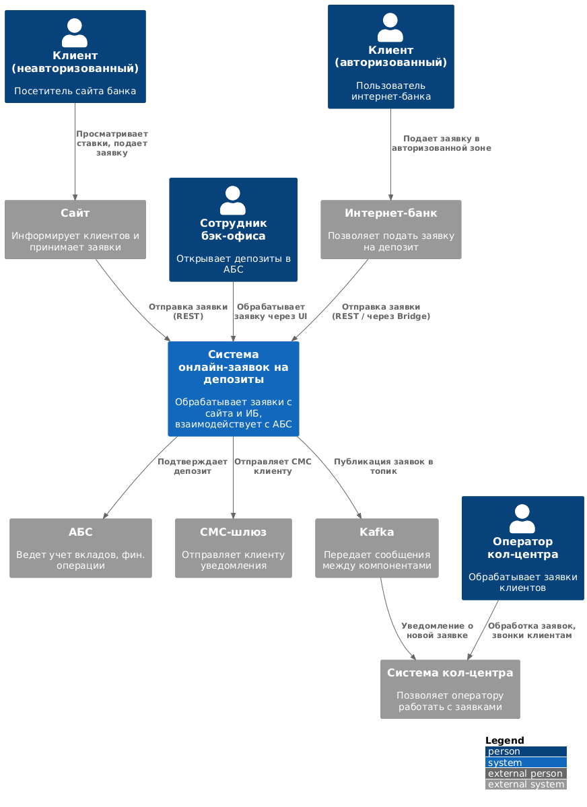
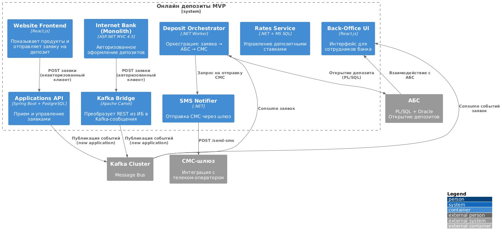

### Название задачи
**ADR‑003 — MVP: Открытие депозитов онлайн**

### Автор  
**Islom Gulomkodirov**

### Дата  
**2025‑07‑14**

---

## Функциональные требования (Use Cases)

| №    | Участники                    | Use Case                    | Описание шагов |
|:----:|------------------------------|-----------------------------|----------------|
| UC‑1 | Клиент (неавторизованный) / Сайт | Подать заявку на депозит | 1. Клиент открывает страницу депозитов 2. Сервис ставок возвращает список продуктов с публичными ставками 3. Клиент вводит ФИО и номер телефона → нажимает "Отправить заявку" 4. Frontend вызывает API «Заявки» 5. API публикует событие в Kafka (topic `deposit-applications`) |
| UC‑2 | Менеджер кол‑центра          | Обработка заявки с сайта     | 1. Система уведомляет о новой заявке 2. Менеджер звонит клиенту, уточняет условия 3. Менеджер при необходимости обновляет ставку через UI |
| UC‑3 | Клиент (авторизованный) / Интернет‑банк | Подать заявку на депозит | 1. Клиент входит в ИБ 2. Запрашиваются персональные ставки (GET /rates) 3. Клиент выбирает продукт, счёт, сумму 4. Подтверждение через СМС 5. Заявка отправляется через API |
| UC‑4 | Сотрудник бэк‑офиса          | Обработка заявки             | 1. В UI отображается очередь заявок 2. Сотрудник проверяет данные, подтверждает ставку 3. Orchestrator отправляет запрос в АБС 4. АБС открывает депозит и возвращает номер счёта 5. Клиент получает PUSH или СМС-уведомление |
| UC‑5 | Система → Клиент             | Получить уведомление         | После успешной обработки заявки клиент получает PUSH + СМС |

---

## Нефункциональные требования

| №      | Требование |
|--------|------------|
| NFR‑1  | SLA: 99,9 % доступности сайта и интернет-банка |
| NFR‑2  | 90 % пользовательских запросов ≤ 300 мс |
| NFR‑3  | Шифрование трафика (TLS 1.3), соответствие ПДн и GDPR |
| NFR‑4  | Горизонтальное масштабирование frontend и middleware; АБС — только вертикальное масштабирование |
| NFR‑5  | Kafka используется как очередь событий; ИБ взаимодействует через REST↔Kafka Bridge |
| NFR‑6  | Мониторинг — Prometheus/Grafana, логирование — ELK Stack |
| NFR‑7  | Документация API — OpenAPI 3.1, ADR, run‑books |
| NFR‑8  | CPU/RAM utilization ≤ 40% при средней нагрузке |
| NFR‑9  | Переключение на резервный ЦОД ≤ 15 минут; RPO ≤ 5 минут |

---

## Решение

### C4 Context Diagram  
  

**Контексты:**
- Клиенты (через сайт и ИБ)
- Система кол‑центра (React + SpringBoot)
- АБС (PL/SQL + Oracle)
- SMS-шлюз
- Kafka-кластер
- Партнёрский кол‑центр (через Webhook)

---

### C4 Container Diagram  

| Контейнер         | Технология                     | Назначение |
|-------------------|--------------------------------|------------|
| Website Frontend  | React.js                       | UI для подачи заявки (неавторизованные пользователи) |
| Internet Bank     | ASP.NET MVC 4.5 (монолит)      | Авторизованный UI, REST-вызыв через Kafka Bridge |
| Rates Service     | .NET 7 + MS SQL                | Хранение и расчёт ставок (публичные и персональные) |
| Applications API  | Java Spring Boot + PostgreSQL  | CRUD по заявкам, публикация событий в Kafka |
| Kafka Bridge      | Apache Camel                   | REST → Kafka для несовместимого интернет-банка |
| Orchestrator      | .NET Worker                    | Saga: заявка → АБС → уведомление |
| SMS Notifier      | .NET 7                         | Отправка СМС через SMS-шлюз |
| Back-Office UI    | React.js                       | Интерфейс бэк-офиса для обработки заявок |
| ABS Adapter       | PL/SQL                         | Взаимодействие с АБС через API-пакеты |
| Monitoring Stack  | Prometheus, Grafana, ELK       | Мониторинг и логирование сервисов |

---

## Логика архитектурных решений

- **Событийная архитектура (Event-driven)** через Kafka: снижает нагрузку на АБС и упрощает масштабирование.
- **Kafka Bridge** нужен из-за устаревшего ИБ на ASP.NET 4.5 — позволяет не переписывать монолит.
- **Rates Service** отделён от XLS-файлов — использует MS SQL для быстрой интеграции и поддержки.
- **Orchestrator** реализует бизнес-логику открытия депозита и управления цепочкой вызовов.
- **Back-Office UI** на React — аналогичен подходу в системе кол-центра.
- Все новые компоненты разворачиваются в контейнерах (Docker + Kubernetes) — для будущей гибкости и отказоустойчивости.

---

## Альтернативы

| Вариант | Причина отклонения |
|--------|--------------------|
| Расширение монолита ИБ | Усложняет поддержку и нарушает изоляцию логики |
| Синхронный REST-запрос ИБ → АБС | Повышенная нагрузка на АБС, нет буферизации при сбоях |
| RabbitMQ вместо Kafka | Внутри банка сделан выбор в пользу Kafka; слабая экспертиза по Rabbit |
| Полный rewrite ИБ в микросервисы | Выходит за рамки MVP и 6-месячного плана |

---

## Риски и ограничения

- **Legacy .NET 4.5** — ограничивает интеграции, требует дополнительных решений (Bridge).
- **Монолитная АБС** — только вертикальное масштабирование; bulk-операции нужно дозировать.
- **Kafka Adoption** — новая технология для команды ИБ; потребуется обучение и PoC.
- **Бэк-офис в MVP** — ручная обработка заявок может стать узким местом при росте трафика.
- **Регуляторные изменения** — возможные изменения KYC/ПДн могут повлиять на процесс.
- **Зависимость от подрядчиков** — контроль обновлений ядра ИБ и кол-центра вне команды; требуется SLA и взаимодействие.

