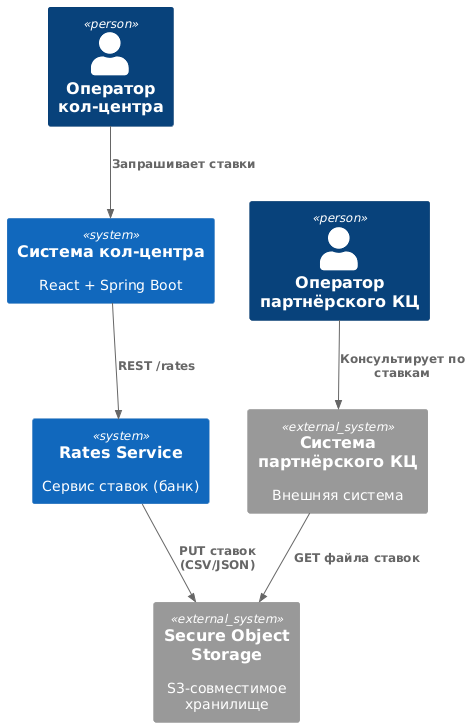
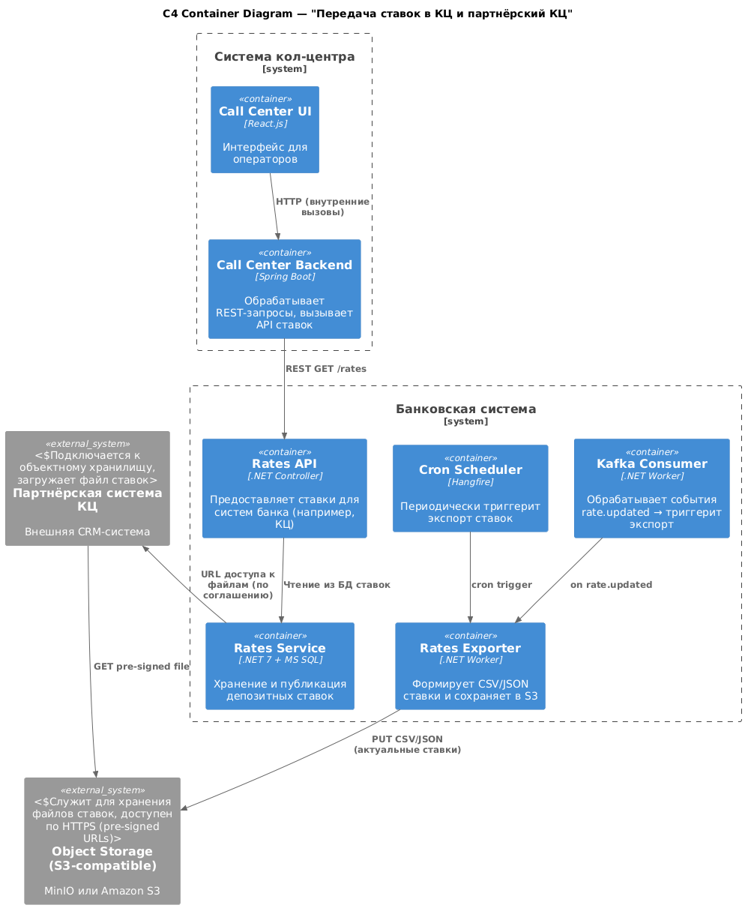

### Название задачи  
**ADR‑004 — Передача актуальных депозитных ставок в кол‑центр и партнёрский кол‑центр**

### Автор  
Islom Gulomkodirov

### Дата  
2025‑07‑14

---

## Функциональные требования (Use Cases)

| №   | Участники / Система             | Use Case                             | Описание шагов |
|:---:|----------------------------------|--------------------------------------|----------------|
| UC‑1 | Оператор кол‑центра             | Просмотр ставок в интерфейсе         | 1. Оператор открывает карточку продукта 2. Кол‑центр (backend) вызывает `/rates/current` API 3. Отображаются действующие ставки |
| UC‑2 | Сервис ставок (банк)            | Экспорт ставок в файл                | 1. Каждые 30 мин или при `rate.updated` формируется CSV/JSON 2. Файл сохраняется в объектное хранилище (S3-compatible) 3. URL с TTL отправляется партнёру |
| UC‑3 | Партнёрский кол‑центр           | Загрузка файла                       | 1. Система загружает файл по HTTPS‑ссылке 2. Проверяет SHA‑256 3. Обновляет справочник ставок |
| UC‑4 | Сотрудник бэк‑офиса (банк)      | Обновление ставки                    | 1. Меняет ставку в UI 2. Сервис ставок обновляет БД и публикует `rate.updated` в Kafka 3. Триггерится delta‑экспорт |

---

## Нефункциональные требования

| №      | Требование |
|--------|------------|
| NFR‑1  | Обновление ставок в кол‑центре ≤ 5 сек после изменения |
| NFR‑2  | Экспорт файла партнёру каждые ≤ 30 мин и по событию |
| NFR‑3  | Формат: CSV + UTF‑8 / JSON (productId, term, rate, currency, validFrom) |
| NFR‑4  | Доступ к файлу: pre‑signed HTTPS URL (TTL = 1 ч, только на чтение) |
| NFR‑5  | Объём файла ≤ 5 MB при 50k записей |
| NFR‑6  | Повторная выгрузка при сбое (retry max 3 раза) |
| NFR‑7  | Аудит всех операций выгрузки / скачивания (соблюдение GDPR) |

---

## Решение

### C4 Context Diagram  

**Контекст:**
- Кол-центр запрашивает ставки по REST
- Партнёр — получает файл через Object Storage
- Rates Service — отвечает за формирование данных, событийность и выгрузку

---

### C4 Container Diagram  

**Ключевые компоненты:**
- `Rates API` — HTTP endpoint для внутренних систем (low-latency)
- `Rates Exporter` — сервис формирования CSV/JSON, размещения в S3
- `Scheduler` (cron) и `Kafka Consumer` — триггерят экспорт по расписанию и при обновлении
- `Secure Object Storage` — изолированная зона хранения с HTTPS‑доступом

---

## Обоснование решений

| Компонент                         | Причина выбора |
|----------------------------------|----------------|
| **REST API (внутренний)**        | Быстрый доступ, интеграция с уже существующим Java backend |
| **CSV/JSON + Object Storage**    | Простая и надёжная интеграция с партнёром (без API / VPN) |
| **Pre‑signed URL**               | Безопасный временный доступ без раскрытия credentials |
| **Event-driven экспорт**         | Минимальные задержки при обновлении данных |
| **SHA-256 контроль**             | Гарантия целостности при передаче |

---

## Альтернативы

| Альтернатива         | Почему отклонена |
|----------------------|------------------|
| SFTP-передача        | Партнёр не поддерживает SFTP или VPN-туннель |
| REST API к партнёру  | Нет REST-эндпоинта на стороне партнёра |
| RabbitMQ / JMS       | Избыточно для однонаправленного файла, высокая сложность поддержки |

---

## Недостатки и риски

- Возможна задержка до 30 мин, если `rate.updated` не отработает — требуется fallback контроль
- При резком росте объёма (например, сезонное обновление ставок) возможен превышенный размер файла > 5 MB
- Object Storage должен быть открыт в DMZ с HTTPS, требует внимания InfoSec
- Ответственность за загрузку на стороне партнёра — SLA не контролируется банком

---

## Список крупных задач по системам

| Система / Команда               | Задачи |
|---------------------------------|--------|
| **Rates Service (.NET)**        | - Реализовать REST API `/rates/current` - Экспортер (формат CSV/JSON) - Интеграция с S3‑хранилищем - Kafka Consumer (`rate.updated`) - Unit + Integration тесты |
| **Кол‑центр (Spring Boot)**     | - Интеграция с `/rates/current` - Кеширование ответов (TTL 5 сек) - Обновление UI карточки продукта |
| **Партнёрский КЦ (внешний)**    | - Импорт по HTTPS-ссылке - SHA‑256 и размер файла валидация - Обновление внутреннего справочника ставок |
| **DevOps / Infra**              | - Поднять MinIO / S3-хранилище в DMZ - Настроить bucket, IAM + HTTPS - Мониторинг загрузок и алерты Prometheus |
| **InfoSec / Compliance**        | - Утвердить формат и требования безопасности - Проверка политики доступа и шифрования |
| **QA / Тестирование**           | - Сквозные сценарии: изменение ставки → выгрузка → загрузка партнёром - Негативные кейсы: ошибки сети, контроль суммы, устаревший файл |
